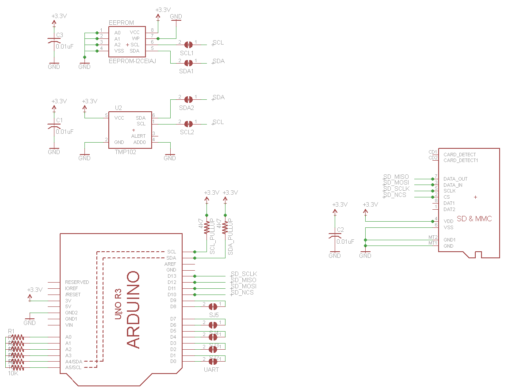
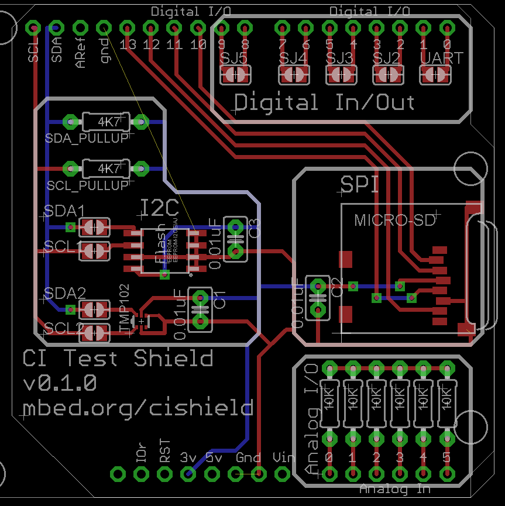

# ci-test-shield
This repo contains the eagle schematics for the ARM mbed CI Test shield. 

## How to reproduce
0. (Optional) Download eagle files
1. Buy PCB from OSHPark or other service
2. Buy Components from Element14 or other vendor
3. Buy Headers from Samtec or other vendor
4. Assemble board

## Software
There is a companion program that uses the CI Test Shield. You can find the program here <TODO>. 

## More information
For more information see the [Releases](/releases) page.

## License
Apache 2.0 - feel free to re-use, tweak, modify for personal or business use. 
